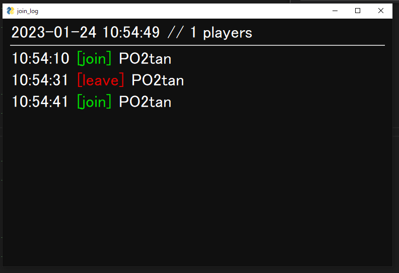

# VRChat風join list
  

## ファイル説明
VRChat_join_listy.py  
 メインの実行ファイルです  

ble_test.py  
 Bluetoothのデバイス名を調べるファイルです、実行して判明したデバイスIDとデバイス名をVRChat_join_list.pyに書き込んでください  

## VRChat_join_list.pyの説明
14|MAX_PLAYER_LIST_NUM  
 ログの最大表示数です、表示数がこの数を超えると古い順にログが上書きされていきます  
15|FONT_SIZE  
 文字通りフォントのサイズです画面に合わせて変更してください  
22|["**:**:**:**:**:**", "device_name", "PO2tan"]  
 BluetoothのデバイスID, デバイス名, 表示する際の名前  
